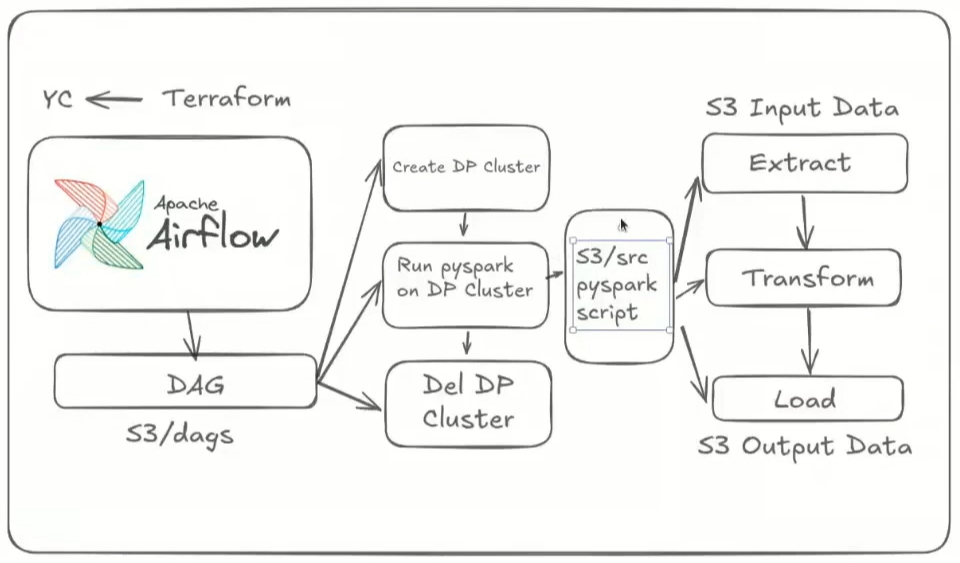
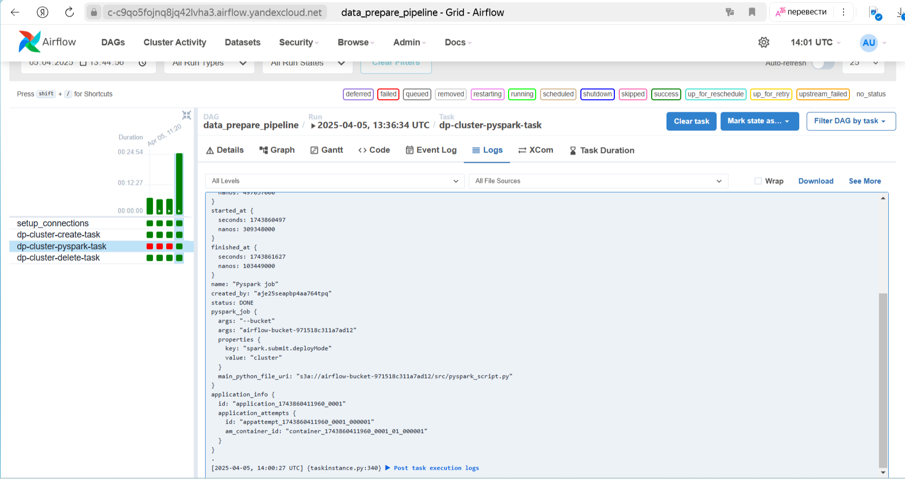
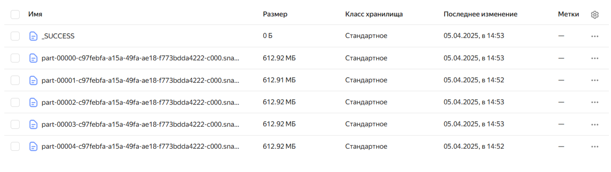

# OTUS. Практика. Конвейер подготовки данных

## Описание практической работы

### 1 Схема пайплайна обработки данных

### 2 С помощью terraform в yandex cloud создаются все необходимые ресурcы:

- сервисный аккаунт со всеми необходимыми правами;
- сети и подсети в облаке;
- бакет в котором будут храниться: "сырые" данные для обработки; предобработанные данные; директория `dags` (синхронизирующаяся с Airflow кластером); директория `src` с основным python-скриптом, который предобрабатывает данные и сохраняет их в директории `output_data` бакета; директория `Airflow-logs` c логами тасков Airflow.
- Airflow кластер;

При создании кластера в yandex cloud локально сохраняется файл со всеми переменными для работы с Airflow в фвйле `variables.json`. Данный файл необходимо загрузить в Airflow -> Admin -> Variables.

После создания всех ресурсов дополнительно заполняется необходимыми переменными файл .env. С помощью команды `make git-push-secrets` в гит отправляются необходимые для CI/CD переменные в раздел actions secrets.
Сам CI/CD позволяет при изменении файлов в директориях `src`, `dags` и пуше в ветку main автоматически загрузить скрипт обработки и сам даг в бакет.

Так же перед запуском самого дага необходимо с помощью например `s3cmd` загуризить созданный бакет в S3 "сырые" данные для обработки, dag-файл, скрипт обработки.

### 3 Проверка работы скрипта обработки данных

Ниже представлены скрины работы Airflow кластера с успешным запуском скрипта обработки и сохранения данных в бакет.

