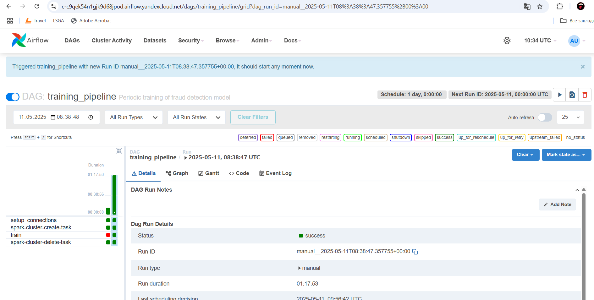
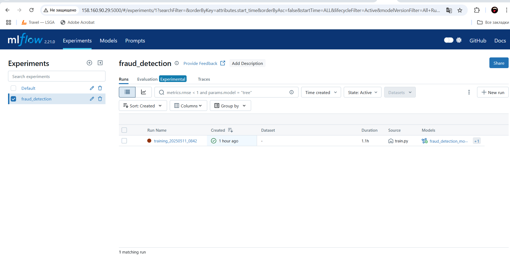
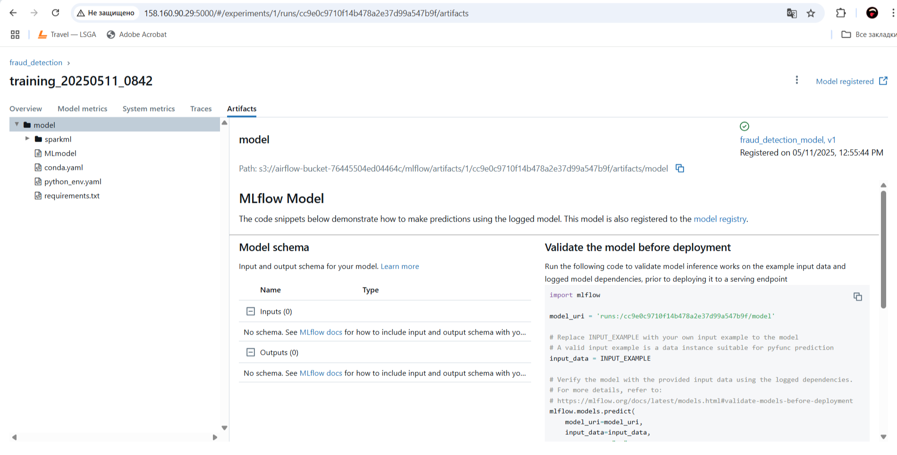
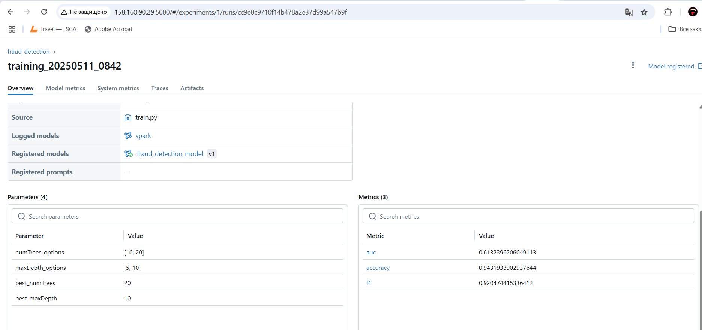

# OTUS. Практика. Регулярное переобучение модели

## Описание практической работы

### Подготовка удаленной виртуальной машины в Yandex-cloud

1) В самом начале необходимо создать виртуальную машину в яндекс облаке. Для данной практической работы машина создавалась через UI-интерфейс облака. Параметры: образ - Ubuntu 22.04 LTS, 2 CPU, 4 Gb Memory, прерываемая.

2) Далее заходим на виртуальную машину по SSH (лучший вариант через VSC) необходимо создать в домашней директории папку: `mkdir -p ~/otus/DZ_6`

3) Затем устанавливаем необходимые пакеты:

```
sudo apt update
sudo apt install software-properties-common -y
sudo add-apt-repository ppa:deadsnakes/ppa -y
sudo apt update
sudo apt install python3.8 python3.8-venv python3.8-dev make s3cmd git -y
```

4) Синхронизируем локальный репозиторий:

`make sync-repo`

5) Установка и настройка terraform на виртуальную машину:

в папке с DZ_6 необходимо выполнить следующие команды:

```
unzip terraform_1.7.5_linux_amd64.zip
sudo mv terraform /usr/local/bin/
rm terraform_1.7.5_linux_amd64.zip
mkdir ~/bin
nano ~/.bashrc
```
Далее необходимо создать следующий файл конфигурации `nano ~/.terraformrc`:

```
provider_installation {
    network_mirror {
        url = "https://terraform-mirror.yandexcloud.net/"
        include = ["registry.terraform.io/*/*"]
    }
    direct {
        exclude = ["registry.terraform.io/*/*"]
    }
}
```

6) Установка ssh-ключей:

перенести файлы ключей из папки .ssh в папке с DZ_6 в ~/.ssh: `mv .ssh/* ~/.ssh/`

7) После поднятия инфраструктуры в yandex cloud необходимо создать и загрузить в S3 бакет все необходимое. Но перед этим нужно настроить s3cmd в интерактивном режиме командой `s3cmd --configure`.

Описание значений полей в файле config для yandex облака можно посмотреть тут -> https://yandex.cloud/ru/docs/storage/tools/s3cmd

8) Для загрузки всего необходимого в S3 бакета необходимо выполнить следующую команду:

`make deploy-full`

### Результаты обучения модели

В результате практической работы выполнены следующие шаги:

1) Подготовлена прокси машина для разворачивания всей необходимой инфраструктуры в Yandex Cloud (Airflow, Mlflow, сервисные аккаунты, сети, подсети, бакеты с данными);
2) Подготовлены все необходимые данные для работы (основной даг, скрипт для загрузки и обучения модели);
3) Метрики обучения модели, включая артефакты сохранены в MLflow.

Скрины по выполнению приложены ниже:






