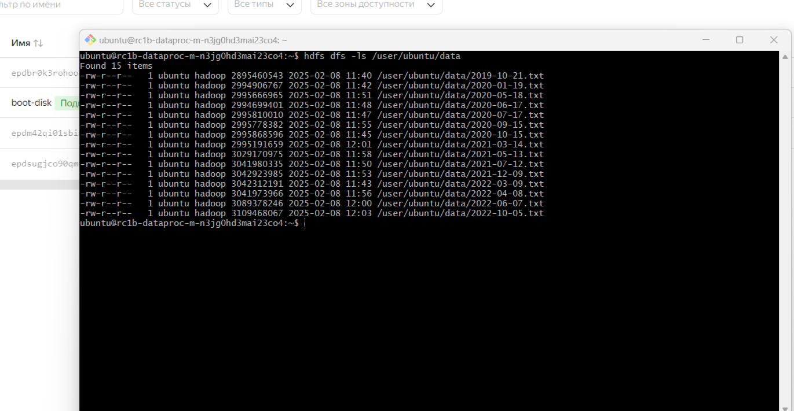

# ДЗ № 2. Настройка облачной инфраструктуры

## План домашнего задания

1. Создать инфраструктуру в Yandex.Cloud с помощью Terraform 
   1. Сервисный аккаунт
   2. Сеть
   3. Объектное хранилище S3
   4. Dataproc кластер
   5. ВМ для доступа к кластеру
 
2. Посмотреть на автоматическую загрузку данных в S3
3. Зайти на мастер-ноду Dataproc и загрузить данные в HDFS

## Выполнение

1. Весь необходимый манифест создан. Добавлены свои настройки в файл terraforms.tfvars

2. Данные загружены автоматически с помощью скрипта. Мой бакет, куда были загружены файлы -> https://storage.yandexcloud.net/otus-bucket-b1g7tkp18f4l17b9fn7d

3. В целях экономии денег, кластер был поднят с небольшим объемом хранилища, поэтому не все файлы были распределены по кластеру, а только те, для которых хватило место. В будущих ДЗ будет поднят уже кластер с достаточным количеством дата-нод и объемом хранилища.

Скрины

